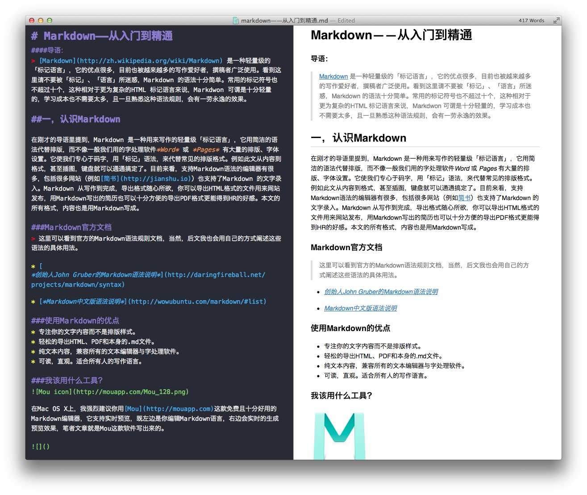

# . Markdown基础语法
**如图： **

**换行 **

　　直接写半方大的空白&ensp;或&#8194;全方大的空白&emsp;或&#8195;不断行的空白格&nbsp;或&#160;两个&emsp;即可。推荐全角空格，切换到全角模式下（一般的中文输入法都是按 shift + space）输入两个空格就行了。这个相对 &nbsp; 来说稍微干净一点，而且宽度是整整两个汉字，很整齐。

**代码块 **

4个空格，就是一个代码块啦
